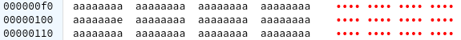

# 留学生日常作业/课程设计/代码辅导/CS/DS/商科，仅为漂洋过海的你❥
标签：Computer Science、Data Science、Business Administration，留学生编程作业代写&&辅导

## 个人介绍:
本人是一名资深码农，酷爱投资。

[为您提供 CS , DS , 商科 编程作业代写](http://dzuoye.work "编程代写")


# Lab 2: ARM assembly programming

## Introduction and documentation

### Experiments ###

Lab experiments for this lab and the next one will be conducted using a simulated ARM processor on a simulated Altera DE1-SoC single board computer.
The FPGA chip on the DE1-SoC has an ARM processor in it that you will programmed.
We will not be using the VHDL configurable fabric of the FPGA in this class.
In later classes, such as [ECSE 325 Digital Systems](https://www.mcgill.ca/study/courses/ecse-325), you will learn how to use both the FPGA fabric and the ARM processor on the chip to do hardware/software co-design.


Altera DE1-SoC


### Board Simulator ###

You will be using a web-based simulator that you will learn to use in this lab.
The simulator is able to simulate the board's processor as well as many of its I/O devices.


### Documentation ###

* [Introduction to the ARM Processor Using Altera Toolchain](docs/ARM_A9_intro_alt.pdf)
* [ARMv7-AR Architecture Reference Manual](docs/DDI0406C_d_armv7ar_arm.pdf)
* [ARM and Thumb-2 Instruction Set Quick Reference Card](docs/QRC0001_UAL.pdf)
* [DE1-SoC Computer Manual](docs/DE1-SoC_Computer_ARM.pdf)
* [Simulator help](http://ecse324.ece.mcgill.ca/simulator/doc/#using)
* [Introduction to the ARM Processor Using Altera Toolchain](docs/ARM_A9_intro_alt.pdf)
* [ARMv7-AR Architecture Reference Manual](https://developer.arm.com/documentation/ddi0406/cd)
* [ARM and Thumb-2 Instruction Set Quick Reference Card](https://developer.arm.com/documentation/qrc0001/m/)
* [DE1-SoC Computer Manual](docs/DE1-SoC_Computer_ARM.pdf)

> :warning: **The quick reference card is the only document you will have access to during the exam, make sure to learn how to use it when programming!**
   


This lab consists of two parts.
The first is an introduction to ARM assembly programming and the tools we will use.
This first part comes with a number of exercises designed to hone elementary assembly programming skills.
There is no need to submit solutions to these exercises; they do not contribute to your grade.

The second part of the lab focuses on the somewhat more advanced assembly programming concepts of function calls, iteration and recursion.
After a brief primer on function calls, part two turns into a series of assignments.
The solutions to these assignments will contribute to your grade.

## Getting started

### Where to find the course software

We will be working with an emulated DE1-SoC Computer System for the labs.
The emulator is available [here](http://ecse324.ece.mcgill.ca/simulator/?sys=arm-de1soc).
The page at that address will look like the image below.


The emulator features a number of different screens.
In this lab, we will focus on the editor (open by default in the middle of the screen), the registers (to the left of the editor), and the memory view (accessible by clicking the "Memory (Ctrl-M)" tab at the bottom of the editor).

As you progress through the lab, we recommend that you save your assembly code by clicking the "Save" button that can be accessed
from the "File" menu in the application bar at the top of the page.
Alternatively, you can use the Ctrl-S keyboard shortcut to save your code into another file/editor.

### Asking for help


If you have trouble getting the emulator to work or if you have any issues at all completing the tasks in this lab, we encourage you to
ask a TA for help.
Likewise, if you have any questions about the lab or the material it covers, we're here to help.
You can ask questions during the lab sessions, or — in case you missed it or have more questions — you can post your questions on the discussion forum.


### Inspecting the default program

Initially, the emulator's editor screen will contain the following assembly code:

```asm
  .global _start
  _start:
```

`_start:` defines a label called `_start`, our program's entry point.
The `.global _start` directive marks `_start` as a global symbol, meaning that `_start` is visible even outside of our code; by default labels are local to our code.
For our purposes, this means that if `_start` is global then the emulator will start program execution at the `_start` label.
Otherwise, it will start program execution at the first instruction in our program.

In this particular case, the `_start` label is at the top of the file, so removing `.global _start` will not influence program behavior.
This is not always the case.
If `_start` is placed anywhere else than the start of the file, failing to mark it as global will affect program behavior.
We recommend that you always mark `_start` as global.

### Running a simple program

The code the emulator gives us by default does not do much.
It introduces an entry point for our program, but includes no instructions.
Let's fix that.

We will write a program that reads a value from a fixed address in memory, adds four to it, and writes it back to that address.
That is, we will write an assembly program that is equivalent to this C code: `*address += 4`, where `address` is some constant address.

In ARMv7 assembly, that looks like so:

```asm
  .global _start
  _start:
    mov r0, #0x100
    ldr r1, [r0]
    add r1, r1, #4
    str r1, [r0]
```

The four instructions in our program accomplish the following tasks:

1. `mov r0, #0x100` moves constant integer `0x100` into register zero (`r0`). The `#0x` prefix indicates a hexadecimal
   number.
2. `ldr r1, [r0]` loads the value stored at the address in `r0` and places the resulting value in register `r1`.
3. `add r1, r1, #4` adds `r1`'s value to constant integer 4 and stores the result in `r1`.
4. `str r1, [r0]` stores `r1`'s value at the address identified by `r0`'s value. That is, it stores the result of our computation in memory at address `0x100`.

#### Executing the program

All that remains to be done here is for us to run the program. Click the
Compile and Load button at the top of the editor to compile our program
and place it in our emulated machine's memory. The editor should
automatically switch to the disassembly view, showing our program's
instructions in memory. Open the memory tab to see the contents of
the emulator's memory as raw hexadecimal numbers.

At this point, the machine's memory should look like the image below.


The emulator has filled our memory with the value `0xaaaaaaaa`, except for the first few addresses, in which our program now resides.
Our program is designed to update address `0x00000100`, which is now `0xaaaaaaaa`.

One way to run the program until completion is to press the Continue (F3) button on the application bar at the top of the page.
Go ahead and do that now.
Address `0x00000100` will now be updated to `0xaaaaaaae` (= `0xaaaaaaaa` + 4).



Similarly, running the program will have changed our register file.


`r0` has been set to `0x00000100` by our `mov r0, #0x100` instruction and `r1` has been assigned value `0xaaaaaaae` by `ldr` and `add`.

Running our program has also changed the value of the `pc` (program counter) register, which keeps track of which instruction will be
executed next.
Every time a non-control instruction is executed, the program counter is incremented by 4, the size of an instruction in bytes.
This corresponds to moving on to the next instruction after the previous instruction is executed.
Control instructions can change the program counter in arbitrary ways, but so far our program consists of non-control instructions
only.

The other registers in the register file remain untouched.

#### Stepping through the program

While running programs to completion can often be convenient, sometimes we want to inspect the state of our emulator as we execute the individual instructions in our program.
We can do so by stepping through instructions using the Step Into button on the application bar at the top of the page.

First, go back to the editor menu and click Compile and Load again.
This will send us to the disassembly menu, which should look like the following image.
Scroll to address zero if the disassembly menu does not show that address already (like in the screenshot).


Run one instruction at a time by repeatedly pressing the Step Into button to run the currently highlighted instruction and proceed to the next one.
As you step through the program, observe how the register file changes with each instruction.
The `mov` instruction will set `r0`'s value; all other instructions will operate on `r1`.
Every instruction will update the `pc` (program counter) register.

After stepping through all instructions, go back to the memory tab and inspect the value stored at address `0x00000100`.
If you ran this lab in a single emulator session, the value at that address is now `0xaaaaaab2` (= `0xaaaaaaaa` + 4 + 4).
This is because the emulator does not reset the contents of its memory after compiling and loading your program.

### Exercises


After following the instructions above, complete the following exercises and observe the effect on the memory and/or registers content.
Remember to save your code into different files as you complete these tasks so you don't lose your progress.

1. Change the address that we read and write to an address of your choice. **Pro tip:** Be careful not to overwrite the program in memory! Since our program consists of four instructions and gets loaded at address `0x00000000`, our program will be stored in memory from `0x00000000` to `0x00000010`.
2. Tweak the constant that we add to the value from memory, e.g., change immediate operand 4 to a 7.
3. Change the temporary registers we use (`r0`, `r1`) to some other set of temporary registers, e.g., `r2` and `r3`.
4. The program we created operates directly on an address stored in a register. The `ldr` and `str` can also include a constant offset. For instance, `ldr r1, [r0, #0x100]` will load the value at the address defined by adding `r0` to `0x100`. Change the `mov` instruction to assign zero to `r0` and modify the `ldr` and `str` instructions to still refer to the same address as before by changing their memory operands to include an offset. Make sure the program still works.
5. When the emulator reaches the end of our program, it stops executing. We could prevent that by appending an endless loop to our program. Introduce a new label at the end of the program. Below that label, insert a `b` (unconditional branch) instruction to jump to the label. The syntax for `b` instructions is `b label`, where `label` is the name of the label you introduced. Step through the program and verify that the branch will forever branch back to itself. **Hint:** look at how `_start` is defined for inspiration on how to define a label. Unlike `_start`, you do not have to make this label global because it does not have any special significance outside of our program.

## Function Calls, Iteration and Recursion

In this lab, we will learn how to work with an ARM processor and the basics of ARM assembly by programming some common routines. 
The following lecture content will be required for conducting this lab: 
compare instructions, branch instructions, shift instructions, load and store instructions, subroutines and function calls.

### Function call basics

> **Note:** For the first two tasks, you only need to know conditional branching using `CMP` followed by `Bxx`, where `xx` is the condition. 
You can use [Condition code suffixes](https://developer.arm.com/documentation/dui0473/c/condition-codes/condition-code-suffixes) to conditionally execute the branch instruction.
A simple example of conditional branching is provided in question 2 of Tutorial 2.


When calling a function, it is important to carefully respect subroutine calling conventions in order to prevent call stack corruption. 
The convention which we will use for calling a subroutine in ARM assembly is as follows:

**Subroutine calling convention**

The **caller** (the code that is calling a function) must:

* Move arguments into R0 through R3. (If more than four arguments are required, the caller should PUSH the arguments onto the stack.)
* Call the subroutine function using `BL` instruction.

The **callee** (the code in the function that is called) must:

* Move the return value into `R0`.
* Ensure that the state of the processor is restored to what it was before the subroutine call by `POP`ing arguments off of the stack.
* Use `BX LR` to return to the calling code.

The state of the processor can be saved by pushing `R4` through `LR` onto the stack
at the beginning of the subroutine.
This state can be restored at the end of the subroutine by popping `R4` through `LR` off the stack.


For an example of how to perform a function call in assembly consider the implementation of vector dot product:


```asm
.global _start				// define entry point

// initialize memory
n: 	      .word 6				    // the length of our vectors
vecA:     .word 5,3,-6,19,8,12		// initialization for vector A
vecB:	  .word 2,14,-3,2,-5,36		// initialization for vector B
vecC:	  .word 19,-1,-37,-26,35,4	// initialization for vector C
result:   .space 8				    // uninitialized space for the results

_start:			        // execution begins here!
	LDR	R0, =vecA	    // put the address of A in R0
	LDR	R1, =vecB	    // put the address of B in R1
	LDR	R2, n		    // put n in R2
	BL  dotp		    // call dotp function
	LDR R4, =result	    // put the address of result in R4
	STR	R0, [R4]	    // put the answer (0x1f4, #500) in result
	
	LDR R0, =vecA	    // put the address of A in R0
	LDR R1, =vecC	    // put the address of C in R1
	LDR R2, n		    // put n in R2
	BL	dotp		    // call dotp function
	STR R0, [R4, #4]    // put the answer (0x94, #148) in result+4
	
stop:
	B	stop

// calculate the dot product of two vectors
// pre-  R0: address of vector a
//       R1: address of vector b
//       R2: length of vectors
// post- R0: result
dotp:
	PUSH {R4-R6}		// push any Vn that we use
	MOV	 R4, #0		    // R4 will accumulate the product
	
dotpLoop:	
	LDR    R5, [R0], #4	    // get vectorA[i] and post-increment
	LDR	   R6, [R1], #4	    // get vectorB[i] and post-increment
	MLA    R4, R5, R6, R4   // R4 += R5*R6
	SUBS   R2, R2, #1		// i-- and set condition flags
	BGT	   dotpLoop
	
	MOV	R0, R4		// put our result in R0 to return it
	
	POP	{R4-R6}		// pop any Vn that we pushed
	BX 	LR			// return
```


Run the provided code and see if you can get the correct results. *Having trouble understanding the code? Your TA is there to help you!*


### Task 1: Shift-and-add integer multiplication


The C code below implements a shift-and-add algorithm to multiply two numbers.


```cpp
int mul(int multiplier, int multiplicand) {
    int sign = 0;
    if (multiplier < 0) {
      sign = !sign;
      multiplier = -multiplier;
    }

    if (multiplicand < 0) {
      sign = !sign;
      multiplicand = -multiplicand;
    }

    int result = 0;
    while (multiplicand != 0) {
      if (multiplicand & 0x1 == 0x1) {
        result += multiplier;
      }
      multiplier <<= 1;
      multiplicand >>= 1;
    }

    if (sign) {
      result = -result;
    }

    return result;
}
```

Your task is to write equivalent assembly code as follows:

```asm
    .global _start
_start:
    // write code that multiplies here...
end:
    B end
```

Your implementation must:

* Load `multiplier` from a label named `multiplier`
* Load `multiplicand` from a label named `multiplicand`
* Put the result of the multiplication inside `R0`
* Must have the global `_start` label
* Must have something like `end: B end` after the multiplication routine

#### Testing Instructions

Take a look at this [sample file](testfiles/sample_test1.s).
The actual tester would prepend that (with different `multiplier` and `multiplicand` values)
into the code you submit.

For example, say you submitted:

```asm
	.global _start
_start:
	MOV R0, R0
end:
	B end
```

We would test it as if it had been:

```asm
multiplier:
	.word 10
multiplicand:
	.word 3

	.global _start
_start:
	MOV R0, R0
end:
	B end
```

### Task 2: Bubble sort ##

Your next task is to implement the [bubble sort](https://en.wikipedia.org/wiki/Bubble_sort) algorithm using assembly. 
Bubble sort is an in-place, iterative algorithm that sorts an array in O(n^2) time.
A version of bubble sort that sorts integers in ascending order is implemented in C below.

```cpp
// Function to perform bubble sort on `array[]`
void bubbleSort(int array[], int size)
{
  for (int step = 0; step < size - 1; step++) {
    for (int i = 0; i < size - step - 1; i++) {
      if (array[i] > array[i + 1]) {
        // If two elements aren't in the right order, then we swap them
        int temp = array[i];
        array[i] = array[i + 1];
        array[i + 1] = temp;
      }
    }
  }
}
```

Your task is to write equivalent assembly code as follows:

```asm
	.global _start
_start:
	// write code that bubble sorts here...
end:
	B end
```

Your implementation must:

* Sort the array located at a label named `array`
* Load the size from a label named `size`
* Must have the global `_start` label
* Must have something like `end: B end` after the bubble sort routine

#### Testing Instructions

Take a look at this [sample file](testfiles/sample_test2.s).
The actual tester would prepend that (with different `array` and `size` values)
into the code you submit.

For example, say you submitted:

```asm
	.global _start
_start:
	MOV R0, R0
end:
	B end
```

We would test it as if it had been:

```asm
array:
	.word 9, 3, -1, 2
size:
	.word 4

	.global _start
_start:
	MOV R0, R0
end:
	B end
```

### Task 3: Lucas numbers

The goal of this part is to compute [Lucas numbers](https://en.wikipedia.org/wiki/Lucas_number).
Like Fibonacci numbers, each Lucas number is defined to be the sum of the two previous Lucas numbers.
Unlike Fibonacci numbers, the first two Lucas numbers are 2 and 1.

The C function below recursively computes the nth Lucas number.

```c
int lucas(int n) {
  if (n == 0) {
    return 2;
  } else if (n == 1) {
    return 1;
  } else {
    return lucas(n - 2) + lucas(n - 1);
  }
}
```

Your task is to write equivalent assembly code as a function as follows:

```asm
lucas:
	// write code that computes the lucas numbers
```

Your implementation must:

* Follow the calling convention, meaning
* Use `R0` to pass `n`, the index of the Lucas number to compute, and
* Use `R0` to store the function's return value.
* Save and restore registers R4-R11 as necessary
* Must return to the correct place

#### Testing Instructions

Take a look at this [sample file](testfiles/sample_test3.s).
The actual tester would prepend that (with different `R0` values for `n`)
into the code you submit.

For example, say you submitted:

```asm
lucas:
	BX LR
```

We would test it as if it had been:

```asm
	.global _start
_start:
	MOV R0, #2
	BL lucas
end:
	B end
lucas:
	BX LR
```

### Task 4: Sobel filter

The [Sobel filter](https://en.wikipedia.org/wiki/Sobel_operator) is an image processing technique that applies a 3x3 [convolution kernel](https://en.wikipedia.org/wiki/Kernel_(image_processing)#Convolution) to an image.
The Sobel operator's kernel is chosen to approximate either the horizontal or vertical derivative of the values in the source image.


For the purpose of this task, we will focus on the horizontal Sobel filter.
Applying that filter to a grayscale picture of the view from Mt. Royal results in the filtered image below.


The filtered image is obtained by applying the following convolutional kernel:
```text
       [ +1, 0, -1 ]
mask = [ +2, 0, -2 ]
       [ +1, 0, -1 ]
```

To perform a convolution on the source image, iterate over each of the image's pixels.
For a pixel with x coordinate `i` and y coordinate `j`, multiply `mask` with a 3x3 window centered around `i`, `j`.
This yields the following 3x3 matrix, where `im` is the input image:

```text
[ +1 * im[i - 1, j - 1], 0, -1 * im[i + 1, j - 1] ]
[ +2 * im[i - 1, j    ], 0, -2 * im[i + 1, j    ] ]
[ +1 * im[i - 1, j + 1], 0, -1 * im[i + 1, j + 1] ]
```

Now sum all elements in this matrix.
This sum is the value of pixel `i - 1`, `j - 1` in the output image. 

Your task is to implement this logic as an assembly subroutine that applies the horizontal Sobel filter to rectangular grayscale images.
Each pixel is represented by 32 bits and is hence stored as a single word in memory.
If `im` is an image, then compute `im[i, j]` as `im[0, 0] + j * size + i`, where `size` is the width/height of the image.

In other words, something that looks like this:

```asm
sobel:
	// write code that applies the Sobel filter here
```

Your implementation must:

* Follow the calling convention, meaning
* Use `R0` to pass a pointer to pixel (0, 0) of the input image
* Use `R1` to pass a pointer to pixel (0, 0) of the output image
* Use `R2` to pass the size of the input image.
* Save and restore registers R4-R11 as necessary
* Must return to the correct place

Note that the output image is smaller than the input image by two pixels in each dimension.
For instance, a 4x4 input image will produce a 2x2 output image. See [this animation](https://towardsdatascience.com/intuitively-understanding-convolutions-for-deep-learning-1f6f42faee1) to help you better understand why the result has fewer pixels.

#### Testing Instructions

Take a look at this [sample file](testfiles/sample_test4.s).
The actual tester would prepend that (with different `R0`, `R1`, `R2` values)
into the code you submit.

For example, say you submitted:

```asm
sobel:
	BX LR
```

We would test it as if it had been:

```asm
	.data
input_image:	// don't refer to this label directly
	.word 0,  1,  2,  4
	.word 5,  6,  7,  8
	.word 9,  10, 11, 12
	.word 13, 14, 15, 16
output_image:	// don't refer to this label directly
	.space 16

	.text
	.global _start
_start:
	LDR R0, =input_image
	LDR R1, =output_image
	MOV R2, #4
	BL sobel
end:
	B end
sobel:
	BX LR
```

You can use the following 4x4 input image to test your implementation:

```text
// Input Image:

input_image: .word 0,  1,  2,  4
             .word 5,  6,  7,  8
             .word 9,  10, 11, 12
             .word 13, 14, 15, 16

// Output Image: 
-8 -9
-8 -8
```

As an additional, larger test input, you can use a 32x32 version of the Mt. Royal picture, included below:

```text
// Input Image:

input_image: .word 186, 186, 186, 183, 181, 181, 182, 184, 185, 187, 189, 192, 195, 199, 201, 200, 202, 199, 197, 197, 195, 195, 196, 196, 197, 200, 199, 198, 191, 183, 179, 177
             .word 179, 179, 179, 176, 175, 175, 178, 180, 182, 185, 188, 191, 194, 196, 197, 198, 199, 199, 197, 197, 198, 196, 194, 194, 195, 195, 195, 198, 196, 189, 183, 180
             .word 171, 170, 170, 169, 169, 171, 174, 178, 182, 187, 191, 192, 192, 189, 188, 188, 190, 192, 193, 194, 194, 192, 190, 190, 188, 189, 192, 195, 197, 194, 189, 186
             .word 162, 163, 164, 165, 167, 171, 175, 179, 183, 186, 186, 184, 181, 180, 180, 182, 182, 185, 187, 187, 185, 183, 183, 184, 183, 183, 186, 189, 188, 187, 187, 185
             .word 168, 174, 174, 172, 169, 171, 174, 178, 181, 182, 181, 181, 180, 176, 180, 178, 180, 180, 178, 175, 175, 177, 179, 180, 181, 181, 182, 185, 185, 184, 185, 186
             .word 179, 182, 183, 180, 178, 177, 178, 183, 185, 184, 184, 186, 186, 177, 185, 178, 174, 174, 173, 171, 171, 177, 189, 186, 185, 186, 187, 188, 189, 188, 187, 188
             .word 195, 195, 194, 192, 193, 181, 187, 190, 190, 190, 194, 195, 194, 192, 195, 192, 194, 195, 195, 193, 192, 193, 194, 194, 194, 194, 169, 184, 194, 193, 193, 190
             .word 196, 196, 197, 195, 171, 119, 118, 173, 193, 194, 191, 196, 197, 196, 196, 195, 195, 194, 195, 194, 194, 194, 195, 195, 195, 185, 98,  135, 194, 194, 193, 191
             .word 194, 195, 176, 127, 127, 121, 124, 126, 121, 164, 125, 179, 197, 196, 173, 168, 188, 194, 194, 194, 195, 196, 196, 197, 195, 147, 99,  99,  180, 195, 194, 193
             .word 187, 193, 179, 132, 130, 123, 118, 122, 121, 153, 116, 177, 196, 177, 131, 124, 172, 193, 192, 193, 193, 193, 194, 193, 193, 102, 95,  98,  148, 193, 193, 192
             .word 138, 171, 167, 130, 129, 122, 120, 126, 127, 144, 115, 168, 183, 160, 115, 105, 149, 179, 180, 179, 179, 180, 180, 180, 180, 99,  87,  98,  140, 182, 182, 177
             .word 93,  97,  113, 127, 118, 118, 118, 115, 124, 131, 104, 155, 159, 141, 104, 104, 135, 156, 157, 157, 158, 154, 157, 157, 159, 97,  89,  95,  129, 161, 161, 150
             .word 95,  91,  103, 120, 114, 105, 111, 110, 125, 111, 118, 147, 152, 128, 100, 102, 131, 143, 114, 118, 135, 142, 161, 153, 173, 96,  88,  93,  141, 189, 189, 184
             .word 105, 102, 100, 98,  100, 130, 192, 146, 93,  100, 101, 103, 95,  75,  94,  98,  135, 114, 118, 119, 103, 91,  122, 136, 106, 97,  89,  94,  114, 141, 124, 109
             .word 102, 103, 136, 82,  92,  99,  109, 92,  116, 114, 105, 98,  90,  83,  91,  97,  117, 120, 118, 117, 122, 83,  96,  99,  115, 98,  91,  94,  116, 147, 108, 88
             .word 109, 98,  105, 71,  76,  83,  78,  84,  100, 107, 96,  94,  103, 112, 118, 115, 112, 137, 132, 131, 136, 87,  89,  131, 120, 98,  91,  95,  110, 127, 92,  71
             .word 129, 114, 104, 68,  87,  104, 99,  78,  72,  72,  79,  83,  79,  77,  125, 147, 141, 124, 128, 132, 129, 105, 122, 101, 101, 98,  92,  107, 97,  120, 63,  77
             .word 138, 121, 113, 75,  76,  95,  94,  99,  83,  76,  87,  82,  81,  119, 151, 145, 127, 118, 112, 125, 103, 105, 116, 97,  105, 107, 106, 108, 99,  98,  75,  113
             .word 133, 115, 110, 71,  71,  97,  89,  92,  104, 78,  85,  90,  92,  112, 104, 110, 113, 108, 108, 100, 90,  90,  102, 121, 114, 113, 103, 125, 103, 90,  74,  97
             .word 138, 126, 114, 69,  82,  101, 83,  99,  110, 99,  88,  90,  88,  122, 129, 110, 116, 111, 123, 93,  100, 102, 113, 103, 109, 119, 94,  105, 109, 137, 81,  106
             .word 80,  110, 102, 72,  66,  74,  71,  82,  108, 166, 161, 114, 153, 136, 123, 126, 120, 111, 131, 94,  135, 142, 108, 83,  98,  106, 122, 118, 129, 119, 78,  104
             .word 65,  107, 107, 77,  63,  107, 81,  136, 140, 186, 124, 125, 147, 136, 108, 121, 118, 114, 129, 101, 96,  69,  88,  77,  101, 114, 133, 105, 81,  68,  88,  110
             .word 61,  102, 93,  135, 165, 159, 166, 142, 117, 131, 142, 123, 127, 151, 115, 97,  124, 107, 96,  101, 108, 95,  120, 132, 107, 87,  100, 48,  50,  70,  81,  100
             .word 122, 144, 105, 159, 155, 135, 117, 123, 101, 129, 116, 86,  119, 110, 110, 105, 93,  104, 109, 108, 114, 111, 107, 102, 103, 69,  65,  72,  61,  48,  68,  56
             .word 140, 120, 132, 129, 142, 132, 126, 122, 104, 112, 90,  128, 102, 90,  100, 99,  83,  118, 84,  101, 115, 97,  69,  104, 108, 97,  116, 96,  71,  70,  81,  54
             .word 135, 80,  97,  101, 97,  99,  98,  111, 83,  106, 87,  109, 88,  87,  84,  104, 83,  109, 126, 89,  91,  59,  104, 102, 96,  106, 111, 85,  111, 105, 40,  47
             .word 152, 114, 82,  92,  88,  78,  84,  122, 89,  84,  86,  84,  90,  118, 80,  98,  93,  89,  88,  92,  91,  100, 107, 75,  81,  96,  72,  48,  95,  113, 76,  35
             .word 97,  101, 71,  71,  99,  73,  85,  87,  84,  106, 103, 104, 83,  90,  93,  86,  101, 107, 94,  95,  86,  134, 91,  81,  73,  69,  36,  57,  86,  66,  57,  34
             .word 98,  71,  106, 95,  66,  87,  107, 94,  113, 86,  88,  90,  73,  83,  78,  101, 99,  118, 115, 92,  76,  117, 89,  93,  82,  57,  40,  50,  74,  70,  47,  52
             .word 84,  82,  90,  59,  84,  99,  104, 83,  87,  89,  106, 66,  87,  92,  77,  82,  62,  89,  82,  63,  96,  104, 76,  78,  55,  64,  64,  59,  67,  62,  22,  55
             .word 95,  72,  56,  86,  68,  78,  80,  80,  69,  82,  80,  72,  81,  83,  73,  106, 88,  62,  61,  93,  77,  77,  82,  65,  55,  78,  71,  69,  82,  52,  27,  43
             .word 69,  66,  47,  56,  51,  29,  31,  48,  71,  88,  116, 91,  82,  60,  57,  80,  64,  47,  37,  52,  59,  60,  79,  66,  85,  78,  48,  46,  45,  39,  25,  48

// Output Image: 
1    10   14   2    -12  -20  -19  -22  -25  -22  -19  -14  -8   -4   -7   -5   6    4    -1   6    11   5    -1   -5   -6   -10  1    34   46   32
0    3    3    -9   -21  -27  -28  -30  -27  -14  -3   5    6    -2   -8   -12  -9   -4   -1   9    14   5    3    2    -11  -21  -13  13   30   27
-9   -1   0    -13  -26  -30  -31  -27  -15  0    10   16   6    -5   -6   -12  -11  -1   6    8    4    -3   0    2    -11  -22  -12  6    10   10
-18  4    12   -1   -18  -28  -29  -16  -2   2    5    23   2    -7   9    -3   0    11   10   -6   -24  -16  0    -1   -7   -16  -10  4    3    -2
-13  9    16   18   1    -28  -24  -6   -2   -8   -3   26   1    -4   23   3    3    13   10   -14  -42  -22  6    -1   20   2    -32  -8   5    1
-3   9    33   101  65   -78  -88  -22  -5   -14  -8   15   0    0    14   -1   -1   7    9    -6   -23  -12  4    10   145  68   -148 -77  5    9
17   73   102  169  115  -122 -150 -80  -4   -24  -84  -14  25   30   -12  -27  -7   2    4    -2   -5   -4   1    70   315  158  -298 -223 -11  11
43   198  173  97   71   -63  -72  -128 -1   -56  -230 -34  114  110  -70  -120 -32  0    -2   -4   -4   -3   3    201  387  150  -311 -346 -72  8
5    231  185  32   36   -7   -10  -118 18   -87  -300 -9   222  189  -131 -238 -77  0    -2   -3   -4   -1   3    313  385  57   -240 -370 -146 9
-70  113  120  34   30   -4   -23  -83  49   -96  -271 30   256  200  -140 -269 -104 -1   0    1    -2   -3   -1   313  354  8    -199 -329 -161 22
-77  -48  17   41   12   -3   -33  -51  59   -108 -212 55   230  155  -127 -219 -58  23   -22  -19  -25  -17  -16  258  318  8    -186 -312 -154 32
-31  -84  -27  7    -86  -23  65   28   26   -99  -117 80   160  66   -134 -150 29   44   -28  -17  -70  -70  -10  213  257  11   -171 -305 -138 53
-32  0    33   -66  -198 -30  177  69   2    -26  -7   90   53   -34  -139 -96  50   18   5    66   -38  -117 1    136  143  13   -128 -243 -60  128
-59  73   117  -78  -128 -3   63   -21  18   42   29   40   -16  -54  -87  -84  -5   7    3    140  80   -121 -53  74   94   14   -94  -185 24   206
-1   121  119  -77  -33  31   -24  -62  12   31   1    -15  -77  -90  -30  -44  -28  7    -13  149  127  -100 -60  70   91   1    -68  -130 78   214
79   165  100  -104 -44  47   43   12   -14  -15  -1   -43  -177 -169 -2   51   21   -17  3    118  48   -28  22   29   46   -16  -22  -48  110  127
98   182  130  -102 -66  23   34   66   4    -35  5    -90  -198 -120 23   79   48   -14  35   77   -31  -11  31   -9   18   -23  9    42   111  6
95   191  147  -104 -55  8    -46  51   56   -21  -8   -113 -135 -10  19   30   18   27   68   31   -50  -55  -9   -10  36   -11  -8   48   110  2
49   196  139  -92  -25  1    -106 -70  10   58   1    -108 -64  36   20   15   -20  61   60   -56  -11  26   6    -47  17   4    -37  -30  136  70
-62  163  148  -66  -29  -43  -160 -218 -68  174  -7   -87  58   47   9    36   -40  65   48   -73  49   109  11   -99  -65  -1   23   3    123  19
-138 65   52   -86  -42  -49  -106 -173 -46  182  -23  -72  120  94   -26  19   -5   49   50   22   31   6    -3   -52  -81  45   147  51   6    -99
-89  -51  -150 -54  18   17   55   -34  -49  120  4    -91  72   128  -11  -12  29   21   4    41   -9   -73  17   86   20   84   156  17   -76  -110
10   -72  -182 21   91   51   103  9    -41  78   -3   -38  32   55   42   -27  -5   15   -53  4    48   -26  -18  118  75   34   103  52   -55  -30
71   -54  -70  20   69   20   75   19   9    8    -28  74   17   -30  52   -42  -61  50   -32  35   86   -48  -66  43   7    20   94   56   44   82
154  -29  -16  15   18   -58  47   58   9    -22  -18  48   20   -23  6    -20  -82  54   36   56   4    -68  3    -22  -29  91   22   -79  151  210
204  53   -40  28   21   -114 6    62   -17  -1   11   -32  14   27   -33  -8   -26  26   37   -25  -50  60   78   -34  40   129  -96  -159 138  246
114  58   -22  18   -9   -79  -9   8    -10  0    51   1    -15  10   -50  -50  3    47   52   -111 -39  155  69   39   125  79   -157 -103 104  160
4    5    58   -26  -88  -12  6    -9   12   17   69   2    -10  -22  -35  -62  -45  90   72   -130 -11  127  53   98   112  31   -121 -52  128  75
19   8    40   -64  -93  23   39   -6   -24  52   52   -56  23   -21  -6   13   -29  47   -5   -91  22   88   76   51   8    26   -51  -9   172  41
94   5    -22  3    -24  -7   -1   -50  -86  40   51   -17  51   -56  -22  114  61   -41  -68  -17  -10  44   69   -24  -4   55   -22  38   175  16
```

## Submission and grading

Your submission will be graded based on your solutions to tasks 1 through 4.
The contribution of each task to the total grade is as below.
These percentages do not necessarily correlate to how challenging each task is.

  * Task 1: 30%
  * Task 2: 25%
  * Task 3: 25%
  * Task 4: 20%


You should submit one file per task on myCourses.
Each file, should contain your solution, **without** the sample code preprended.
We will mark your submission automatically and preprend the tester code ourself (and testing different input).
Hence you should not include the sample code otherwise you will fail the test.
## 作业代写价格:
|类型|美元|人民币|
|-----:|-----:|-----:|
|Assignment|$40-$120|¥400-¥800|

### 为了方便快速定价和确定是否代做，麻烦提供私聊的时候提供以下信息：
如果是作业，提供本次作业要求文档；如果是考试，提供考试范围和考试时间
一两句话概括一下作业任务或者考试任务，比如”可以帮忙实现一个决策树算法吗？”、”网络安全选择题考试，范围是内网横向移动知识点”
### 作业定价有两种方式：
    - 根据定价标准进行
    - 通过微信我们一起协商
## 联系方式
[为您提供 CS , DS , 商科 编程作业代写](http://dzuoye.work "编程代写")
微信（WeChat）：design2023866


> **Important**: Note that we will check every submission for possible plagiarism. 
All suspected cases will be reported to the faculty. 
Please make sure to familiarize yourself with the course policies regarding academic integrity and remember that all the labs are to be done individually. 
Also please note that you are not allowed to use a compiler to generate the assembly code: you must write it by hand.
